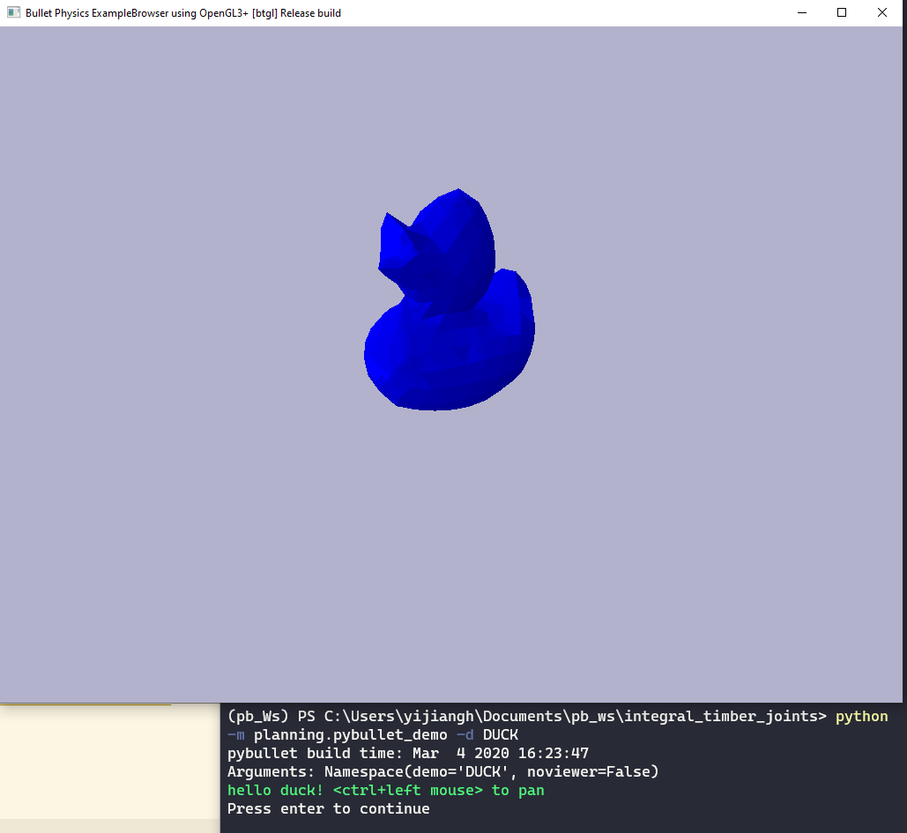
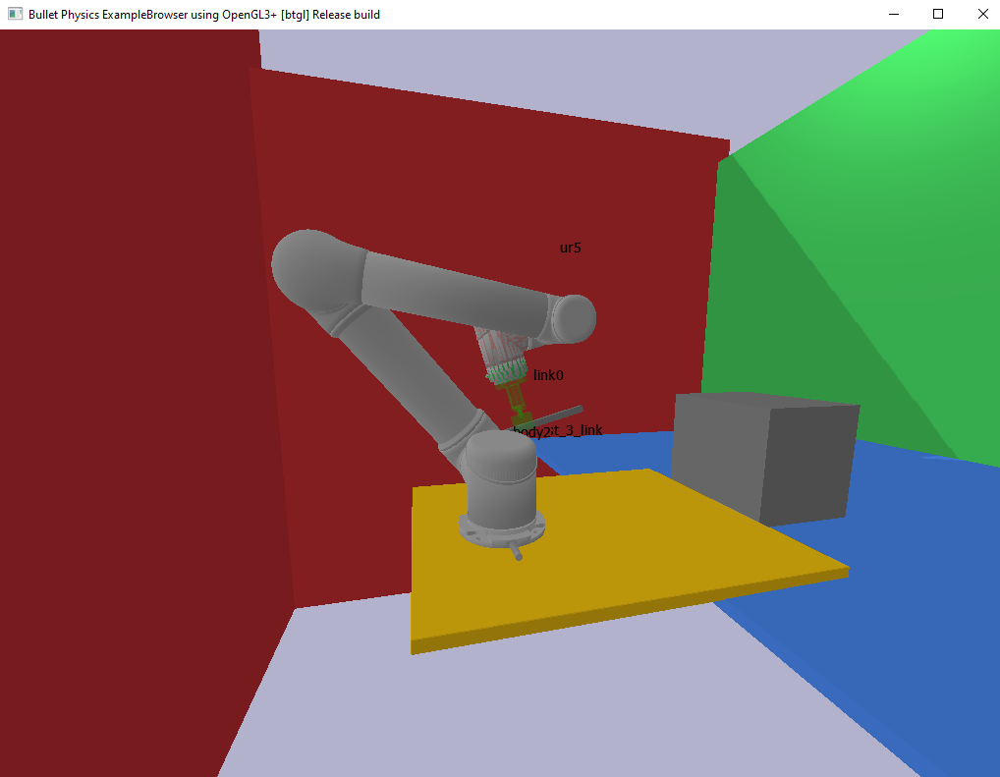
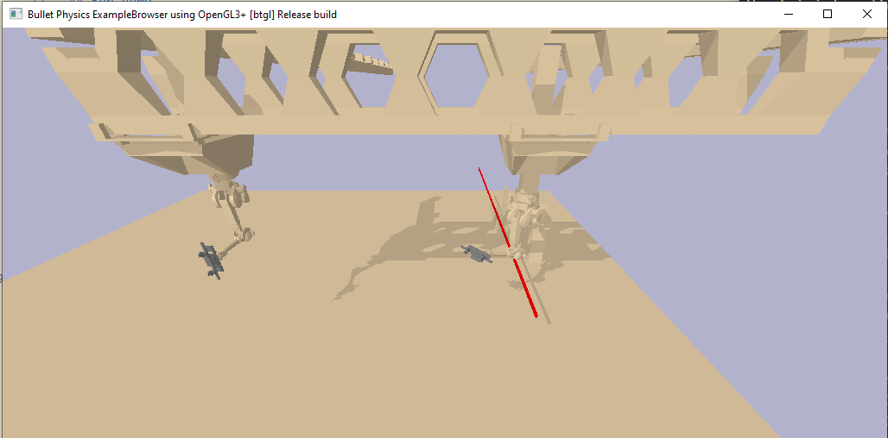
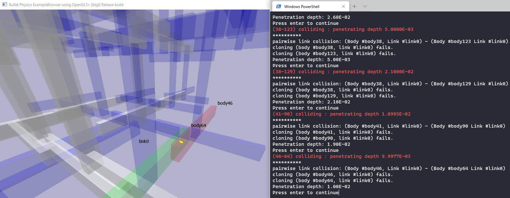

# Pybullet planning tutorial

This tutorial is intended to help you take the first step in incorporating pybullet into your research workflow. Examples are designed specifically to help our colleagues at GKR to have a quick start with robots / contexts that they are familiar with (and to reflect the author's nostalgia for his good summer time there).

## install `pybullet_planning`
In your conda environment, run:

```
pip install git+https://github.com/yijiangh/pybullet_planning@dev#egg=pybullet_planning
```

This will install both [pybullet](https://github.com/bulletphysics/bullet3) and [pybullet_planning](https://github.com/yijiangh/pybullet_planning).

We also use `termcolor` to do colorful terminal printing in this tutorial, install it by:
```
pip install termcolor
```

## Run demos

I include three demos here (code fully commented):
1. [`DUCK`](#Duck-demo): import a mesh object from a obj file into pybullet
2. [`UR`](#Duck-demo): 
    - import a robot (from URDF), a static scene (from URDF);
    - import an end effector and attach an object (from obj) to it; 
    - setting up a collision checking function, and indicate disabled collisions to exonerate collisions between certain link pairs.
    - collision checking for robot self-collision, robot-attachment collision, robot-scene collision
3. [`RFL`](#RFL-demo):
    - load our favorite RFL robot from an URDF
    - randomly sample configuration for all (or subset) of the joints.
    - call a motion planner to find a collision-free connecting path
4. [`Assembly`](#Assembly-demo):
    - create two box beams and check collision at the interface
    - load a list of beams from `obj` files and check collision between each pair of them
    - use `body_collision_info` to get `peneration_depth` from pybullet's [getClosestPoints](https://docs.google.com/document/d/10sXEhzFRSnvFcl3XxNGhnD4N2SedqwdAvK3dsihxVUA/edit#heading=h.cb0co8y2vuvc) return info. Then, we use this peneration depth to filter **touching** out of **truly colliding** cases.
    - Case studies geometry kindly provided by [@kathrindoerfler](https://github.com/kathrindoerfler).


TODO: add block picking example for the RFL demo.

### Duck demo
Run by (in `.\pybullet_planning_tutorials` the root directory):

```python -m examples.pybullet_demo -d DUCK```



### UR demo
Run by (in `.\pybullet_planning_tutorials` the root directory):

```python -m examples.pybullet_demo -d UR```



### RFL demo
Run by (in `.\pybullet_planning_tutorials` the root directory):

```python -m examples.pybullet_demo -d RFL```



### Assembly demo
Run by (in `.\pybullet_planning_tutorials` the root directory):

```python -m examples.pybullet_demo -d Assembly -db```



## PyBullet Resources

* pybullet_planning - https://github.com/yijiangh/pybullet_planning
* Bullet Github - https://github.com/bulletphysics/bullet3
* pybullet Quickstart (doc) - https://docs.google.com/document/d/10sXEhzFRSnvFcl3XxNGhnD4N2SedqwdAvK3dsihxVUA/
* Pybullet Forum - https://pybullet.org/Bullet/phpBB3/
* Pybullet Wordpress - https://pybullet.org/wordpress/
* Original pybullet Examples - https://github.com/bulletphysics/bullet3/tree/master/examples/pybullet/examples
* Python Bindings from the original cpp code - https://github.com/bulletphysics/bullet3/blob/master/examples/pybullet/pybullet.c
* ss-pybullet (pybullet_planning's origin) : https://github.com/caelan/ss-pybullet
